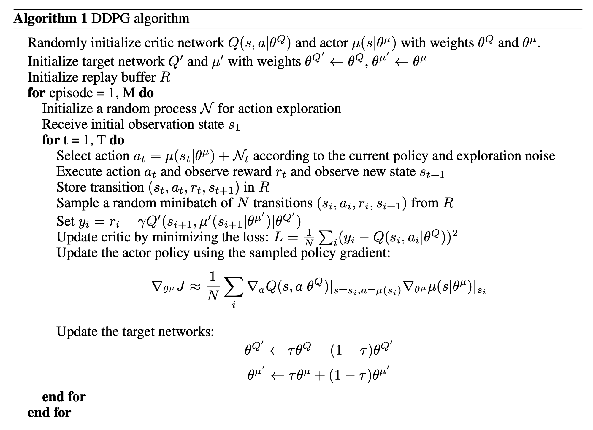
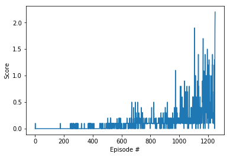

# Project report

## Learning algorithm

The learning algorithm used is [DDPG](https://arxiv.org/abs/1509.02971) as implemented in ddpg-pendulum exercise with elements of [A2C](https://arxiv.org/abs/1806.06914) because of using experience of 2 agents in the same time.



## Algorithm parameters

It is the same my implementation of the algorithm, which I have used in the previous `Continuous Project`

### The neural networks have following structure:

1. Actor

	- Hidden: (input, 256) - ReLU
	- Hidden: (256, 128) - ReLU
	- Output: (128, 4) - TanH

2. Critic

	- Hidden: (input, 256) - ReLU
	- Hidden: (256 + action_size, 128) - ReLU
	- Output: (128, 1) - Linear

### Parameters used in agent:

- replay buffer size: 2e-5
- minibatch size: 128
- discount factor: 0.99
- tau (the coefficient of soft update of target parameters): 1e-3
- learning rate of the actor: 1e-4 
- learning rate of the critic: 2e-4
- L2 weight decay: 0
- Ornstein-Uhlenbeck noise parameters: 
	- theta: 0.15
	- sigma: 0.2

## Results

Plot:



Log:

```
Episode 1249	Max Score: 2.20	Average Max Score: 0.51
Environment solved in 1249 episodes. Average Max Score: 0.51
CPU times: user 12min 29s, sys: 42.1 s, total: 13min 11s
Wall time: 14min 28s
```

## Future improvements

- Add prioritized experience replay
- Experiment with Multi-Agent Deep Deterministic Policy Gradient (MADDPG)
